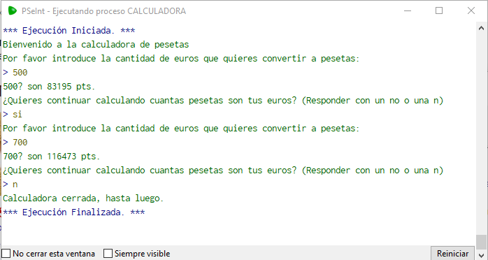

# Ejercicios
## Fase 1
### Lecturas, operaciones e impresiones por consola
1. Escribe un programa que solicite por consola dos números y que realice con ellos las operaciones algebraicas basicas. (Suma, resta, multiplicación y división) 
    > Recuerda que puedes usar el menú de **Operadores y Funciones** para realizar dichas operaciones.
2. Escribe un programa que pinte por consola una pirámide de asteriscos con base 9 
    > Recuerda que puedes rellenar con espacios a la izquierda para que la pirámide quede alineada.
3. Modifica el ejercicio anterior para esta vez pintar la pirámide hueca.
4. Realiza modificaciones sobre el programa anterior para realizar las dos pirámides, pero inversas, es decir una pirámide hueca y otra rellena con el vértice apuntando hacia abajo.
5. Modifica el ejercicio anterior para indicar al usuario que introduzca el tipo de caracter especial con el cual desea realizar la pirámide.
6. Realiza una calculadora de Euros a Pesetas donde el programa tenga la siguientes carácteristicas:
    * De un mensaje al inicio indicando que tipo de programa es.
    * Solicite el importe a convertir a Pesetas.
    * Muestre el resultado e inmediatamente después pida si quiere continuar o no con el cáculo.
    * Si se indica que si que pida nuevamente un importe a convertir, si indica que no que se despida y finalice.
    > Notas: Para poder tener el valor de la conversión de pesetas a euros en una variable constante (Variable que no varía su contenido) y con decimales tendrás que colocarlo de la siguiente manera "`Definir nombre_variable Como Real`", en programación las comas de los decimales es al estilo inglés, (o sea con punto(.) en vez de coma(,)) y por último el valor de 1 euro a pesetas usado fue de 166.39pts por 1€.
    El ejercicio tendrá que quedar de la siguiente manera:

